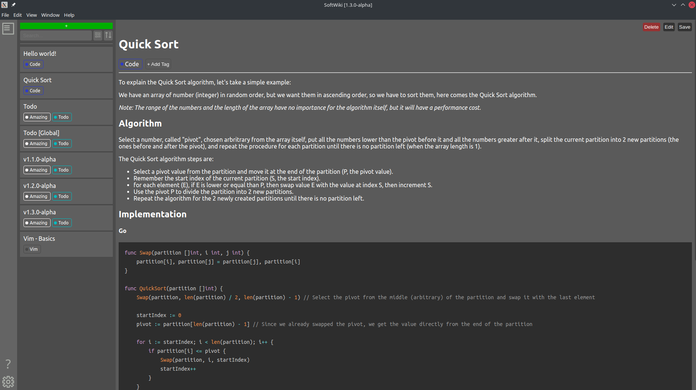

**REWORK IN PROGRESS, THE CURRENT STATE OF THIS REPO IS NOT STABLE**.  
**This application in under development, more information at the end.**

SoftWiki is a wiki-like application, available on Linux and Windows.

## Features

- Mardown syntax.
- Store your notes locally (only a single *db.json* is currently supported, but plain text markdown files will probably also be supported).
- Tags.
- Themes (You can also create your own theme).

## Roadmap & ideas

*As I'm doing this application mainly for my own needs, I might or not implement the following features, but in an ideal world, I probably would.*

- Reference a note from another (internal note links).
- Primary tags (Think of it more like projects/categories)

*The following are just more ideas, so don't really expect them.*

- Data encryption.
- Database, remote database/server for storing data.
- Web application.
- Mobile application.

## Download

[Download links here](https://public-downloads.vyndev.com)

*Windows will probably prevent you to run it the first time, so it's trust it or build it yourself*

## Build from source

*I only tried to build from (Arch) Linux, so I will only provide the steps for linux for the moment,
however you might be able to build it from Windows using WSL or something else using docker.*

### Using docker (Linux)

I tried to simplify the process as mush as possible by using docker.  
So if you have docker installed, all you need is to run `sh build-with-docker.sh` in the root folder of the project.
it will basically create the needed image and run it, you'll then have the build outputs in
`electron/out` with multiple form (executables, zip, squirrel).

### Classic way (still linux, but without docker)

Todo, But look at the `install_required_packages.sh` and `build.sh`

## Why?

I always wanted to have my own wiki to store my knowledge, notes and other things that can be stored in a text file.  
The reason for creating my own application instead of using another markdown app, is mainly because I like to create
things from scratch and want to be able to improve it if I need without depending on someone else.  
I'm also using this project for learning purposes so the code won't be perfect at first.  
  
I plan to let the application free and open source, no paid plan or whatever to use it.

## License

Probably GPL, but nothing decided yet.
